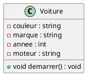
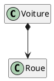
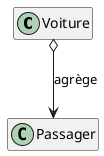
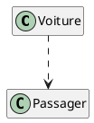
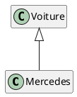
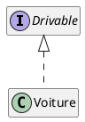
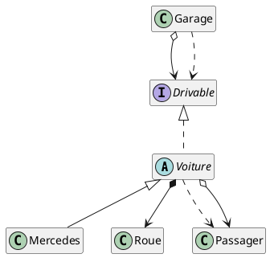

# Modélisation objet

## notions fondamentales

## dépendances entre objets

**composition**

**Agrégation**

## dépendance simple

## héritage : extension

## héritage : réalisation

## Diagramme de classe

